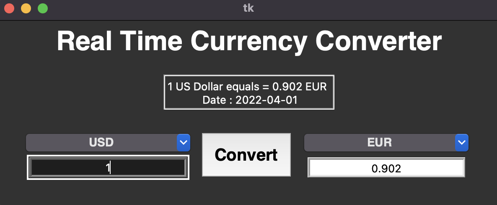
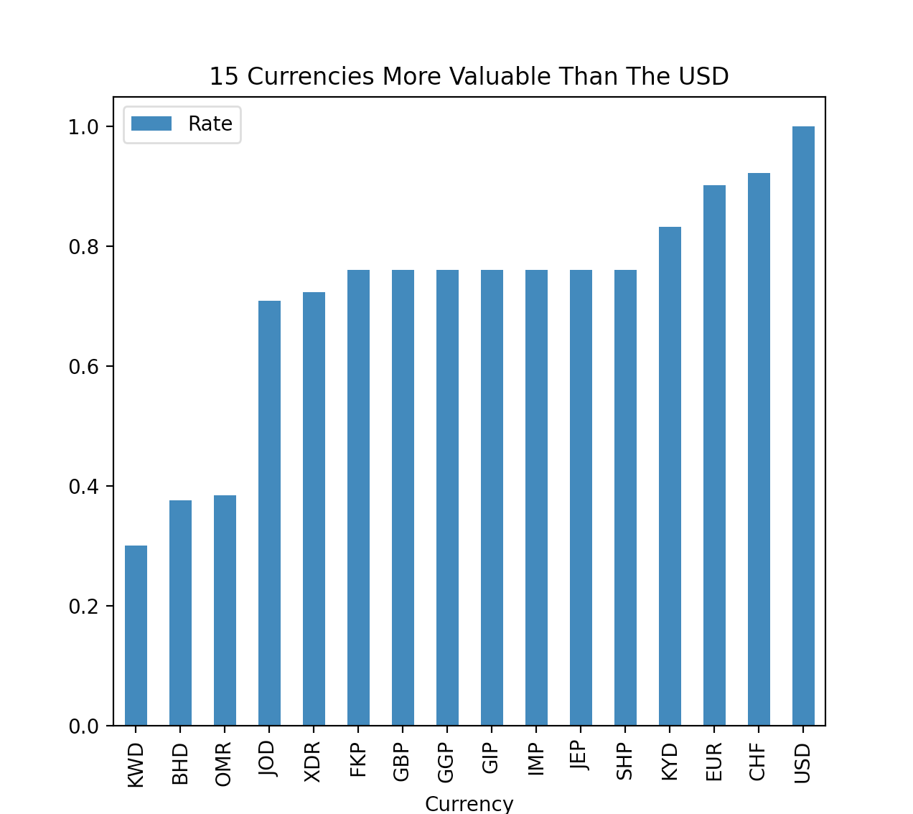

# Real-Time Currency Converter

Do you need to convert a currency into another? This converter features over 150 of the most common currencies and allows you to convert them into each other with up-to-date prices thanks to an easily accessible exchange rate API.

Disclaimer: No warranties or guarantees - express or implied, regarding exchange rate information returned by our API, its completeness or correctness, its accuracy, or its fitness for any particular purpose.




## Installation

This project was created using Python 3.10. A virtual environment is required to run the program.

First, clone the repository: [https://github.com/stefanalytical/real-time-currency-converter.git](https://github.com/stefanalytical/real-time-currency-converter.git)

Once the virtual environment is activated, please install the packages found in the requirements.txt folder.

```bash
pip install -r requirements.txt
```
Run the file
```bash
python Conversion.py
```

Relevant packages that were used:
```bash
pip install requests
pip install tk
pip install pandas
pip install myplotlib
```
## Features Used

Category 1: Python Programming Basics:
```bash
- Implement a “master loop” console application where the user can repeatedly enter commands/perform actions, including choosing to exit the program.
- Build a conversion tool that converts user input to another type and displays it (ex: converts cups to grams).	
```

Category 2: Utilize External Data:
```bash
python Conversion.py
```

Category 3: Data Display:
```bash
python Conversion.py
```

Category 4: Best Practices:
```bash
python Conversion.py
```

Stretch List:
```bash
python Conversion.py
```